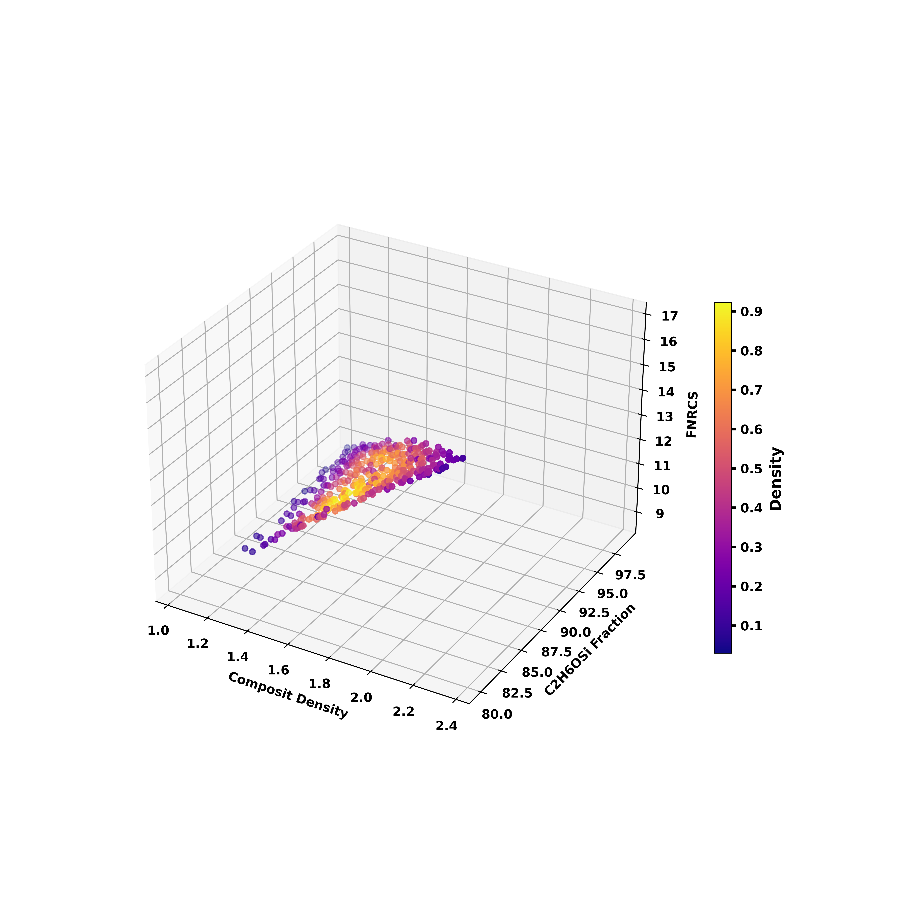
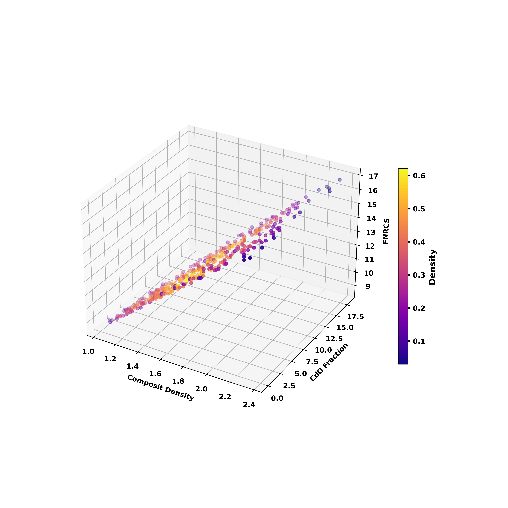
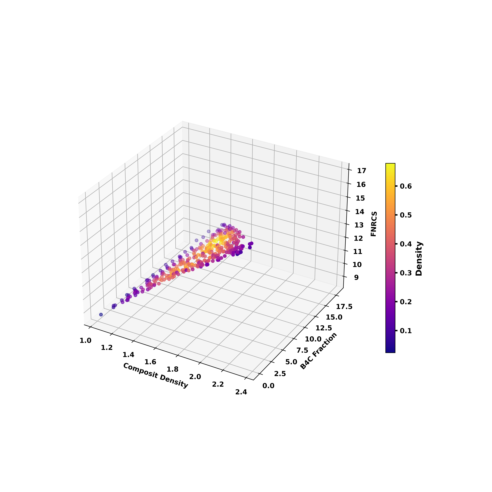
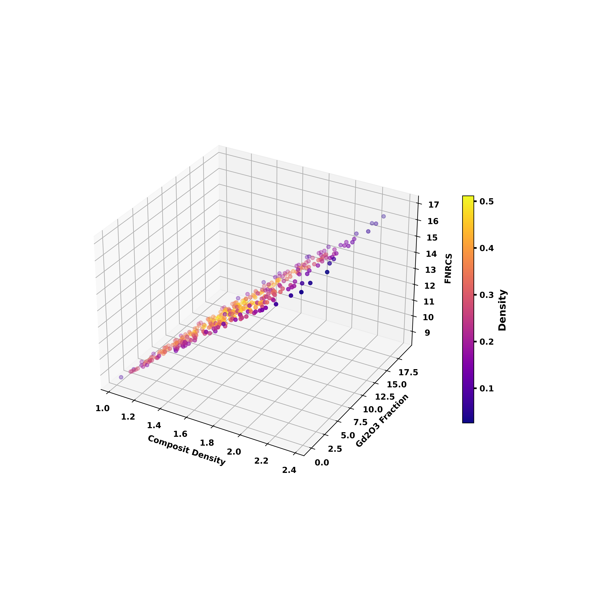

## AI-for-Radiation-Shielding-Composites-Materials-Design

This project focuses on the simulation of composite materials to predict their FNRCS using machine learning. The workflow begins with data collection from simulations, followed by data cleaning and preprocessing using a custom DataHandler to ensure high-quality input for model training. Various machine learning models, including XGBoost, Random Forest, and Artificial Neural Networks (ANN), are employed, with PyTorch used for building and fine-tuning the ANN model. Performance of each model is evaluated using standard metrics to identify the most accurate predictor. The project concludes with the visualization of training outcomes and model performance, providing valuable insights into the predictive accuracy and reliability of the models for composite materials.


<p align="center">
  
  
<!--    -->
</p>

## Density Plots

<p align="center">
  
  
  
  
</p>


## Project Structure

```
├── FNRCS/
  ├── FNRCS_Data/
  │   ├── clean_data/
  │   │  └── clean_data.xlx 
  │   ├── full_data_file/
  │   │  └── data.xlx       # unprocesses excel data fiels 
  │   └── data_cleaning.py  # data cleaning and preprocessing logic
  ├── modeling/
  │   ├── ann.py    # Defines the neural network model
  │   └── ml.py     # XGBOOST and random forest models
  ├── Simulation/
  │   └── simulations.py 
  ├── main.py             # Main script that ties everything together and runs the process
  ├── requirements.txt    # List of dependencies
  └── README.md          
```
## Setup Instructions

### 1. Clone the repository

```bash
git clone https://github.com/your-username/project-name.git
cd project-name
```

### 2. Install dependencies

Run the following command to install all the required packages:

```bash
pip install -r requirements.txt
```

### 3. Setup Environment Variables

Create a `.env` file in the root of the project and specify the following environment variables:

```env
DATA_PATH=/path/to/your/dataset
SAVE_PATH=/path/to/save/output
FILE_NAME=output_file.xlsx
```

- **`DATA_PATH`**: Path to the directory where your input data (Excel files) is located.
- **`SAVE_PATH`**: Directory where the model output will be saved.
- **`FILE_NAME`**: Name of the output file (Excel format).

Ensure that the `.env` file is placed in the root directory of the project so that it can be loaded by the script.

### 4. Dataset

Ensure your dataset is structured correctly and placed in the `DATA_PATH` directory. The data should be in `.xlsx` format and follow the expected structure for loading by the `DataHandler` class.

## Usage

### 1. Running the Script

Once the environment is set up and the `.env` file is configured, you can run the main script:

```bash
python main.py
```

### 2. Key Features

- **Data Preprocessing**: The data is loaded and cleaned using the `DataHandler` class from the `data_processing/data_loader.py` file. It removes empty values, processes composition data, and creates DataLoader objects for model training.
  
- **Seed Initialization**: The `initialize_seed` function ensures that the training process is reproducible by setting the random seed for PyTorch, NumPy, and Python's built-in `random` module.

- **Model Training**: The script trains the model using the `Trainer` class from the `modeling/trainer.py` file. It applies early stopping to prevent overfitting and monitors validation losses during training.

- **Model Evaluation**: After training, the model is evaluated using the `evaluate` method, and various performance metrics are calculated.

- **Visualization**: The `Visualizer` class generates plots to visualize the training loss and predictions.

- **Saving the Output**: After training and evaluation, the model's predictions and other relevant data are saved to an Excel file in the `SAVE_PATH` directory.
## Classes and Functions

### `DataHandler` (data_processing/data_loader.py)

- **`load_data`**: Loads the dataset from the provided file.
- **`preprocess_data`**: Preprocesses the data by handling missing values and splitting it into training and testing sets.

### `Trainer` (modeling/trainer.py)

- **`train`**: Trains the model for a specified number of epochs, applying early stopping if necessary.
- **`evaluate`**: Evaluates the model on the test dataset and returns predictions.
- **`scores`**: Computes performance metrics for the model, such as accuracy, precision, recall, etc.

### `Model` (modeling/model.py)

- Defines a neural network model built with PyTorch. The model architecture depends on the specific problem you're solving and can be modified in this file.

### `Visualizer` (modeling/visualizer.py)

- **`plot_loss`**: Plots the training and validation loss.
- **`plot_predictions`**: Plots the actual vs predicted values.

### `initialize_seed` (main.py)

- Initializes random seeds for reproducibility of results.

### `prepare_data` (main.py)

- Prepares the data, including loading, preprocessing, and converting it to tensors.

### `train_and_evaluate_model` (main.py)

- Trains the model and evaluates its performance using the `Trainer` class.

